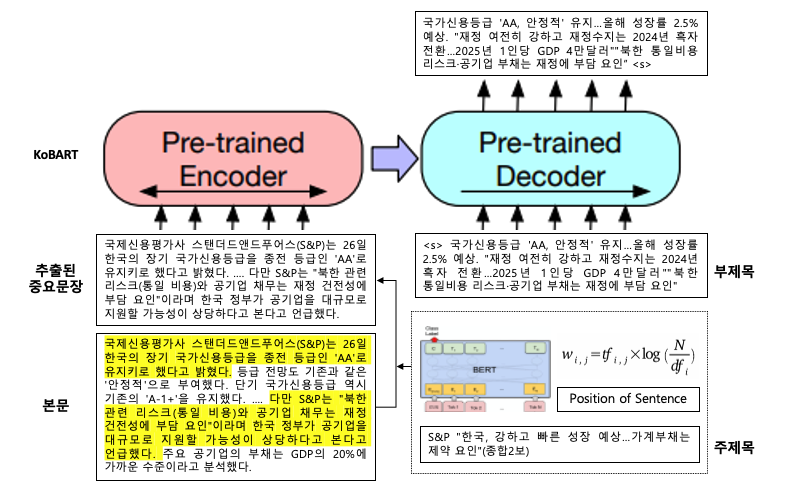

# Abstractive-Subtitle-Generation-based-on-Extraction-in-News-Article
---

2022 KCC에 학부생 논문으로 제출한 '추출 기반의 뉴스 부제목 생성 프레임워크'에 대한 코드입니다.
뉴스의 부제목(=Subtitle)을 뉴스의 요약문으로 간주한 후, KoBART를 활용해 부제목을 생성하도록 학습한 프로젝트입니다.

뉴스의 길이가 길어질 경우, 본문의 앞쪽 문장을 절사해서 사용할 수 밖에 없는 한계를 극복하기 위해
뉴스의 부제목의 특성을 고려해 중요문장을 추출한 후에 부제목을 생성하도록 프레임워크를 설계하였습니다.

#### Structure of Framework

#### 중요문장 추출을 위해서 고려한 바는 다음과 같습니다.

1. 주제목(title)과 부제목(subtitle)의 유사성
  EDA결과 뉴스의 부제목은 본문의 어떤문장보다 주제목과 유사하다는 결론을 얻어 
  뉴스의 주제목과 부제목간의 TF-IDF Cosine Similarity & BERT [CLS] Embedding의 Cosine Similairty를 활용해 lexical & semantic similar한 문장이 중요문장으로 추출하도록 하였습니다.

2. 위치편향
  EDA결과 뉴스의 부제목과 유사한 본문 문장은 앞쪽에 위치한다는 결론을 얻어 
  본문의 앞쪽에 있는 문장들이 중요문장으로 추출될 확률이 높도록 하였습니다.
 
 #### 다음의 수식을 기반으로 중요문장을 추출하였고, [data_analysis.ipynb](https://github.com/Lainshower/Abstractive-Subtitle-Generation-based-on-Extraction-in-News-Article/blob/main/dataset/data_analysis.ipynb)에서 확인이 가능합니다.
 
 > $$ f(X) = \alpha \cdot sim_{BERT}(x) + (1-\alpha) \cdot sim_{TF-IDF}(x) + \beta \cdot pos(x) $$ 
 
 #### Quantitatve Results

| Encoder Input | Encoder Max Len | $$ \alpha $$ | $$ \beta $$ | BERT Score | Rouge Score |
|:---:|:---:|:---:|:---:|:---:|:---:|
|truncated|	512 |	- |	-	| 0.6924 | 0.246 |
|truncated|	1024 |	-	| -	| 0.6904 |0.141 |
|extracted|	512 |	0.7 |	0.1 |	0.6937 |	0.239 |
|extracted|	512 |	0.7 |	0.2 |	0.6921 |	0.240 |
|extracted|	512 | 0.7 |	0.3 |	0.6935 |	0.236 |
|extracted|	512 |	0.9 |	0.1 |	0.6932 |	0.241 |
|extracted|	512 |	0.9 |	0.2 |	0.6916 |	0.243 |
|extracted|	512 |	0.9 |	0.3 |	0.6925 |	0.239 |

 #### Qualitative Results 

| Reference Title |	올들어 공정위 환급과징금 이자 150억원…대형소송 또 진행중 |
|:---:|:---:|
| Reference Subtitle | 10년 소송 끝에 퀄컴 부분 패소…이자가 원금 ⅓로 불어나이자 산정 방식 바뀐 후 최다 액수…"퀄컴 1조 과징금 소송 승소 노력" |
  
| Encoder Input | $$ \alpha $$ | $$ \beta $$ | Generated Subtitle | BERT Score |
|:---:|:---:|---:|:---:|:---:|
|truncated|	- |	-	| 농심 담합 과징금 환급금 이자 139억원 | 0.569 |
|truncated|	0.9	| 0.2	| 농심 담합 과징금 환급금 이자 139억원...공정위 "3년 만에 가장 많아질 듯" | 0.668 |
|extracted| 0.7 |	0.1 |	농심 담합 과징금 환급금 이자 139억원...2016년 3월 이후 최대 |	0.672 | 
 
